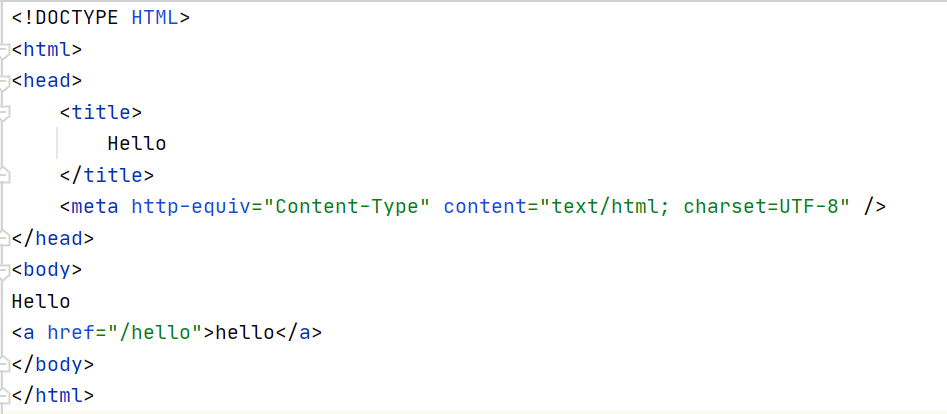
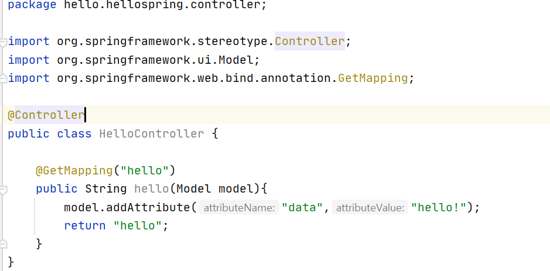
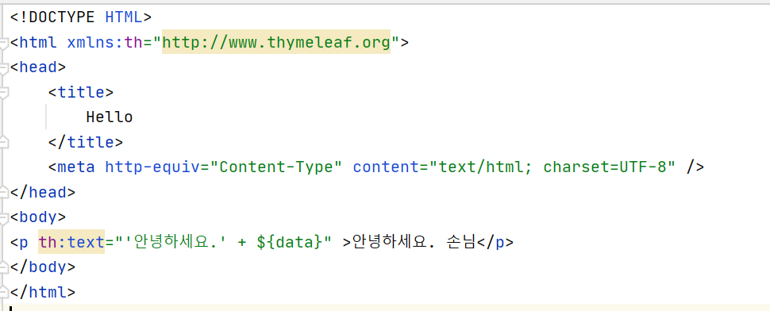
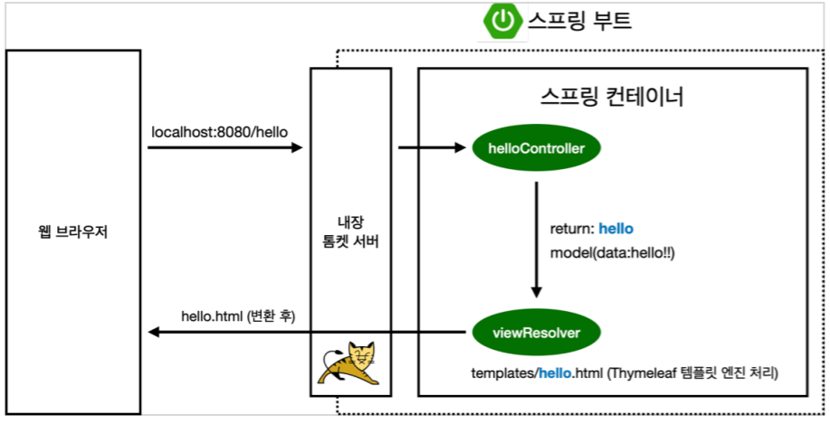
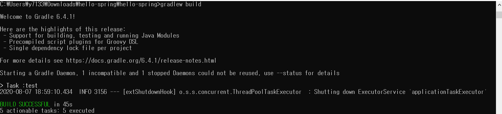
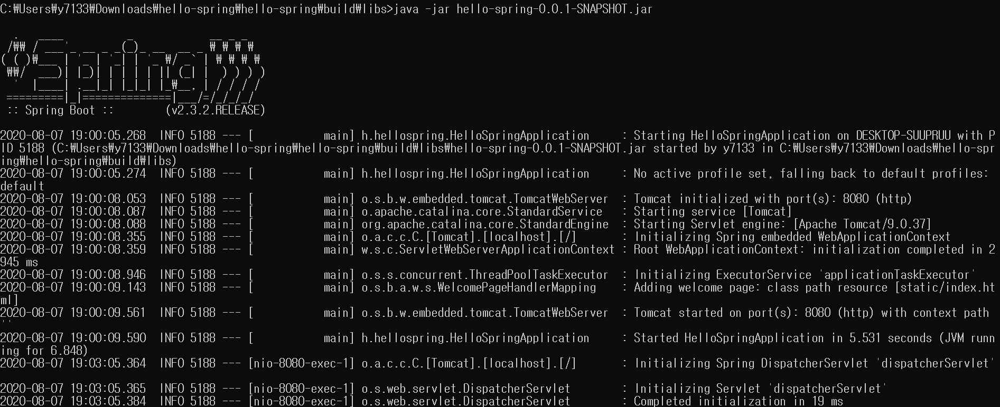
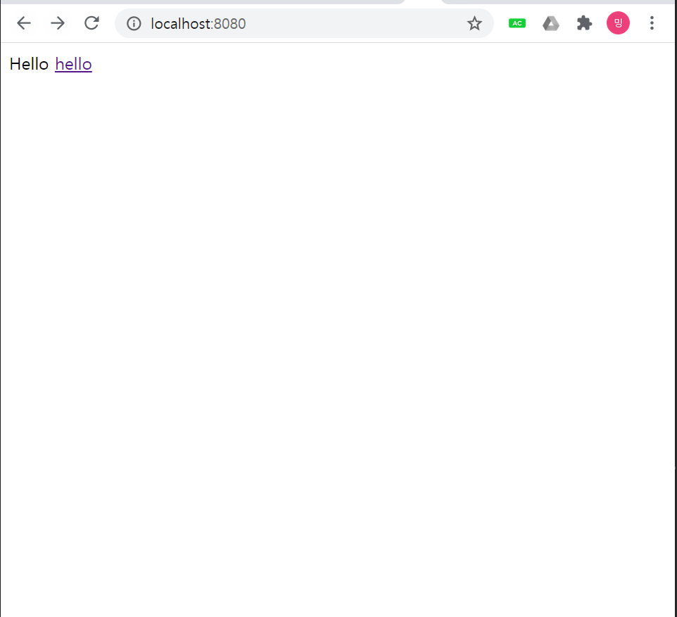
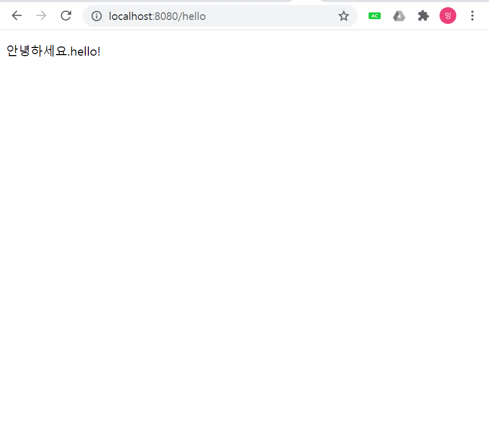

<h1> 환경설정</h1>

<h3>프로젝트 생성</h3>

----------------------
 

<b>*설치과정*</b>

1) intellij-IDE 설치
2) Springboot에서 
    - gradle project 
    - java
    - springboot 2.3.2
    - project group: hello,  project name: hello-spring,  project Artifact: hello-spring
    - SpringWeb,Thymeleaf를 dpendencies에 추가
3)Intellij에서 hello-spring.zip 열기

 

<b>*바로 main실행*</b>
<pre>
localhost:8080 //url
</pre>

Error message 페이지가 나오면 성공

톰켓서버를 내장하고 있음

 

*preference-> gradle-> BUild&run using,runtest: intellij*
- gradle을 거치지 않아 빠르게 실행 

 

<h3>라이브러리 살펴보기</h3>

------------------------

- 라이브러리끼리 의존성을 가지고 있어 intellij에서 자동으로 import

- tomcat을 내장하고 있음

- 라이브러리 옆의 (*)는 이미 다른 라이브러리에 있는 라이브러리라는 뜻

- print보다는 log를 써서 에러 검출이나 코드 검사를 함

 

<b>*스프링 부트 라이브러리*</b>
- spring-boot-starter-web
    - spring-boot-starter-tomcat:톰캣(웹서버)
    - spring-webmvc:스프링 웹 MVC
- spring-boot-starter-thymeleaf:타임리프 템플릿 엔진(View)
- spring-boot-starter(공통): 스프링 부트+ 스프링코어+로깅
    - spring-boot
         - spring-core

    - spring-boot-starter-logging
        - logback,slf4j

 

<b>*테스트 라이브러리*</b>
- spring-boot-starter-test
    - junit: 테스트 프레임워크
    - mockito: 목 라이브러리
    - assertj:테스트 코드를 좀 더 편하게 작성하게 도와주는 라이브러리
    - spring-test: 스프링 통합 테스트 지원

 

<h3> View 환경설정</h3>
 
 -----------------------

 

<b>*hello page만들기*</b>

1. Welcome Page 만들기

 

2. Controller 작성

- Get mapping은 HTTP METHOD의 GET

 

3.hello.html 만들기

 

<b>*동작환경*</b>

- 컨트롤러에서 리턴 값으로 문자를 반환하면 뷰리족버가 화면을 찾아서 처리
- 스프링 부트 템플릿엔진 기본 viewName매핑
- resources:templates/ + {ViewName}+ .html

 

<h3>빌드하고 실행하기</h3>

---------------------------

 

<pre>gradlew build</pre>

 

<pre>cd build/libs</pre>

 

<pre>java -jar hello-spring-0.0.1-SNAPSHOT.jar</pre>

 

