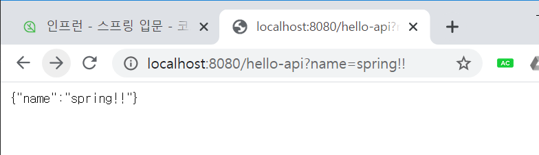

<h1>스프링 웹 개발 기초</h1>

 

<h3>정적 컨텐츠</h3>

---------------------

<b>*정적 콘텐츠*</b>

 

 

 

1) 먼저 컨트롤러를 확인함. 정적 콘텐츠는 컨트롤러가 일반적으로 없음

2) 리소스에서 html파일을 확인하여 리턴함

 

<h3>MVC와 템플릿 엔진</h3>

---------------

 

- 모델,뷰,컨트롤러로 이루어짐
- Model1방식은 jsp만을 이용해서 사용
- view:화면을 그리는데 모든 역량
controller:비즈니스 로직 및 서버와 연결
model: 화면과 관련된 것들을 넘겨줌

 

1) controller

 

2) hello-template.html

 

3) localhost:8080/hello-mvc?name=spring!!

 

- controller의 RequestParam 파라미터 value값을 가지고 모델에 애트리뷰트를 추가한 후 view에 반환한다

- hello-template.html 의 {name}부분이 url에 입력한 name으로 바뀐다

 

<h3>API</h3>

---------------

 

<b>*@ResponseBody 문자반환*</b>

1) hello-spring controller

- viewResolver를 사용하지 않음
- HTTP Body에 문자내용을 직접 반환

 

2)localhost:8080/hello-string?name=spring!!

 

<b>*@ResponseBody 객체 반환*</b>
 

1) hello-api controller

- 객체반환시 객체가 JSON으로 변환

 

2)localhost:8080/hello-api?name=spring!!

 

- @ResponseBody 사용
    - Body에 문자 내용 직접 반환
    - viewResolver 대신에 HttpMessageConverter가 동작
    - 기본 문자처리:StringHttpMessageConverter
    - 기본 객체처리:MappingJackson2HttpMessageConverter(자동으로 JSON으로 변환)
    - byte처리 등등 기타 여러 HttpMessageConverter가 기본으로 등록되어있음