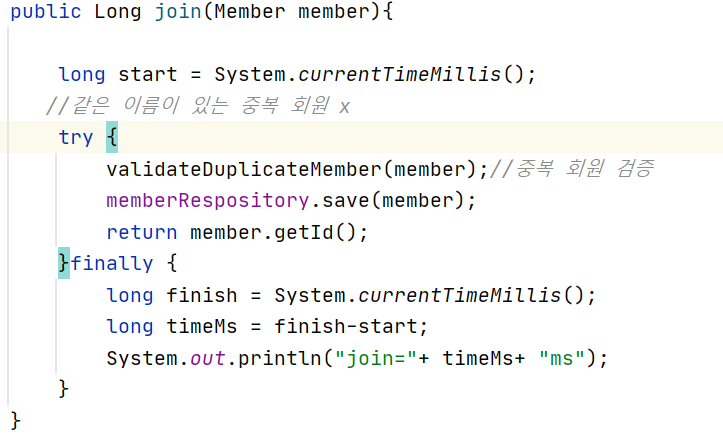
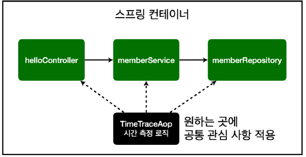

# AOP

### AOP가 필요한 상황

- 모든 메소드의 호출시간을 측정하고 싶을때
- 공통 관심 사항 vs 핵심 관심 사항



- 이러한 로직을 메소드마다 구현해야함

*문제*
- 시간측정 기능은 핵심관심사항이 아님
- 시간을 측정하는 로직은 공통 관심 사항
- 시간 측정 로직과 핵심 비즈니스 로직이 섞여서 유지보수가 어려움
- 시간 측정하는 로직을 별도의 공통 로직으로 만들기 매우 어려움
- 시간 측정하는 로직을 변경할 때 모든 로직을 찾아가면서 변경해야함

<br/>

### AOP 적용

-----------------

**AOP: 공통 관심사항과 핵심 관심 사항 분리**



<br/>

**시간 측정 AOP 등록**


```
@Around("execution(* hello.hellospring..*(..))")
```
- 첫번째 ..은 패키지
- 가로안의 ..은 파라미터(클래스등)

**해결**
- 회원가입,회원 조회등 핵심 관심사항과 시간을 측정하는 공통 관심 사항을 분리
- 핵심 관심 사항을 깔끔하게 유지
- 시간을 측정하는 로직을 별도의 공통 로직으로 만들어짐
- 변경이 필요하면 이 로직만 변경하면 됨
- 원하는 적용 대상 선택 가능

<br/>

### 스프링의 AOP 동작 방식 설명

----------------

**AOP 적용 전 의존관계**


<br/>

**AOP 적용 후 의존관계**

- 프록시라는 가짜 멤버 서비스를 앞에 세워두고 joinPoint.procced() 후 실제 서비스를 호출
    - 코드를 복제해서 조작
- DI가 있어야 AOP도 가능

<br/>

**AOP 적용전vs 적용후 전체 그림**

