# 스프링 DB 접근 기술

### H2 데이터베이스 설치

----------------

- https://www.h2.database.com 에서 다운로드 설치
- h2 열고 데이터 베이스 파일 생성
    - jdbc:h2:~/test(최초 한번)
    - ~/test.mv.db 파일 생성 확인
    - 이후부터는 jdbc:h2:tcp://localhost/~/test 이렇게 접속

**테이블 생성하기**

h2 콘솔 열고 create table

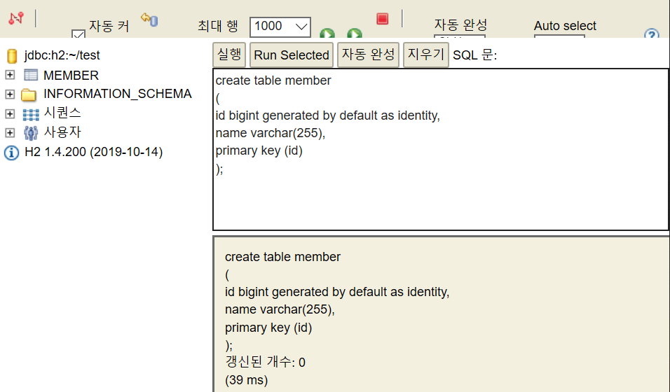


이후 프로젝트 루트에 sql/ddl.sql파일 생성

<br/>

### 순수 JDBC

----------------------

***설정 추가***

- build.gradle에 라이브러리 추가
```
implementation 'org.springframework.boot:spring-boot-starter-jdbc'
runtimeOnly 'com.h2database:h2'
```

- 스프링 부트 DB연결 설정 추가(resources/application.properties)

```
spring.datasource.url=jdbc:h2:tcp://localhost/~/test
spring.datasource.driver-class-name=org.h2.Driver
```

***JDBC 리포지토리 구현***

**Jdbc 회원 리포지토리**

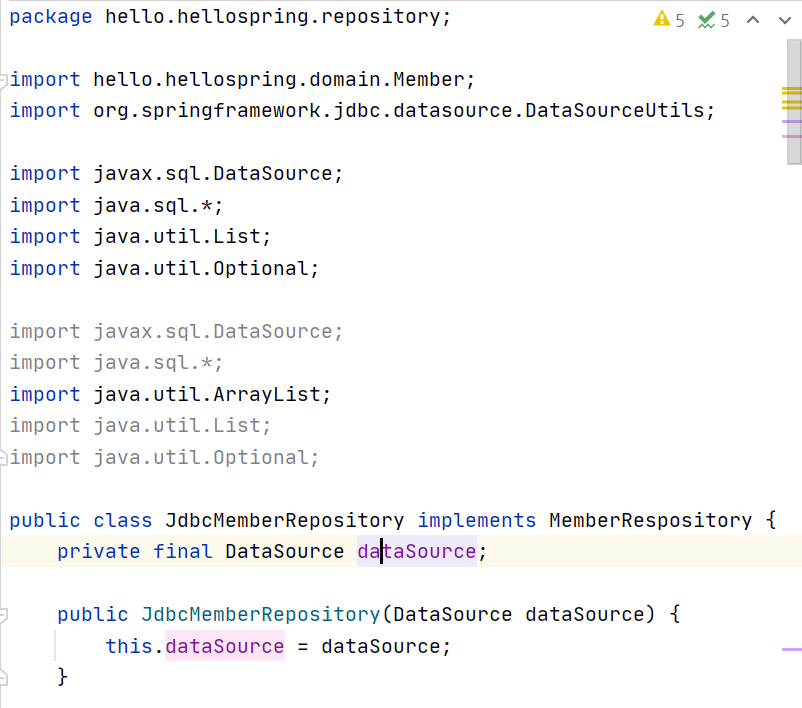

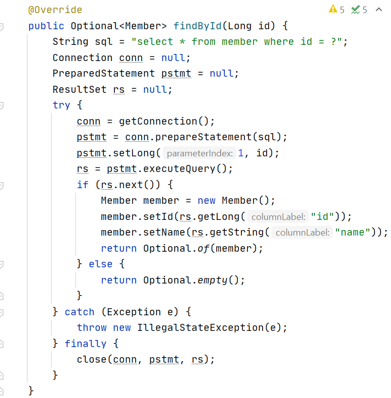
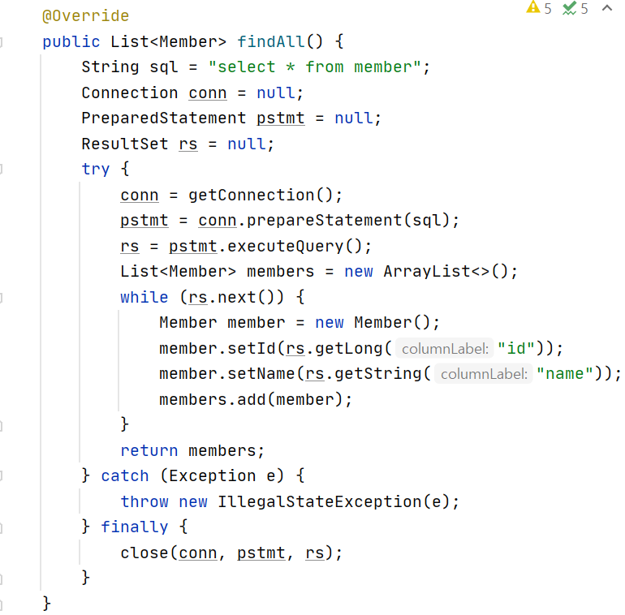
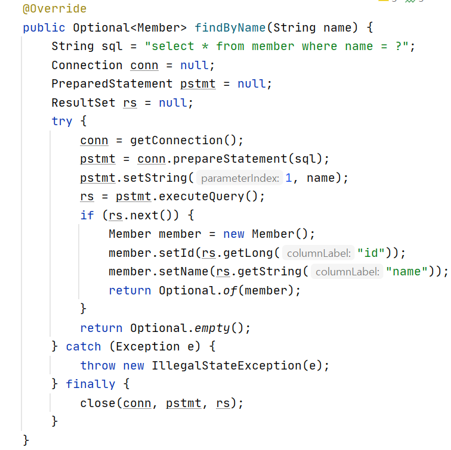
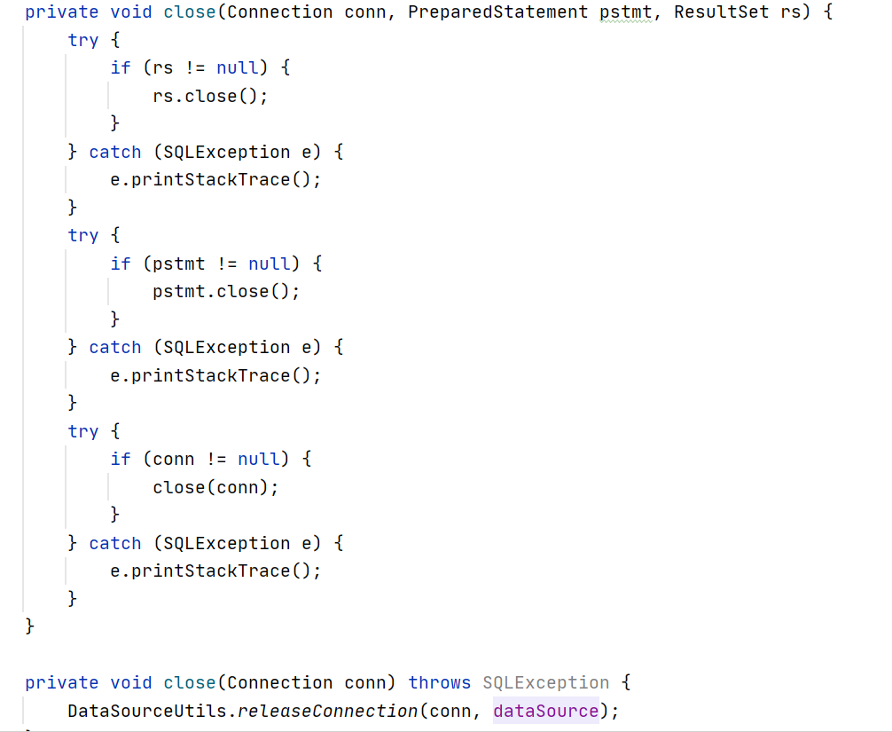

<br/>

**스프링 설정 변경**


- DataSource는 데이터 베이스 커넥션을 획득할 때 사용되는 객체
- 스프링 부트는 데이터베이스 커넥션 정보를 바탕으로 DataSource를 생성하고 스프링 빈으로 만들어둠
그래서 DI를 받을 수 있음
- 인터페이스였던 MemoryMemberRepository를 JdbcMemberRepository로 바꿔넣음

<br/>

***구현 클래스 추가***

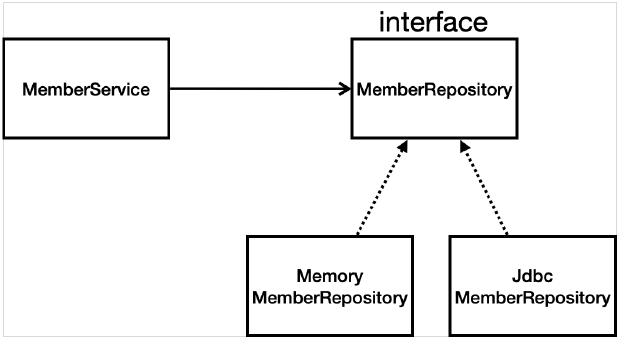

<br/>

***스프링 설정***

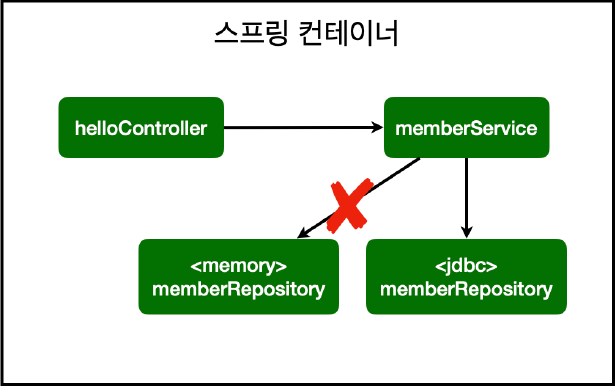
- OCP:확장에는 열려있고, 수정,변경에는 닫혀있음
- 스프링의 DI를 사용하면 기존 코드를 전혀 손대지 않고, 설정만으로 구현 클래스를 변경할 수 있음
- 데이터를 DB에 저장하므로 스프링 서버를 다시 실행해도 데이터가 안전하게 저장

<br/>

### 스프링 통합 테스트

---------------

스프링 컨테이너와 DB연결한 통합 테스트

<br/>

**회원 서비스 스프링 통합 테스트**

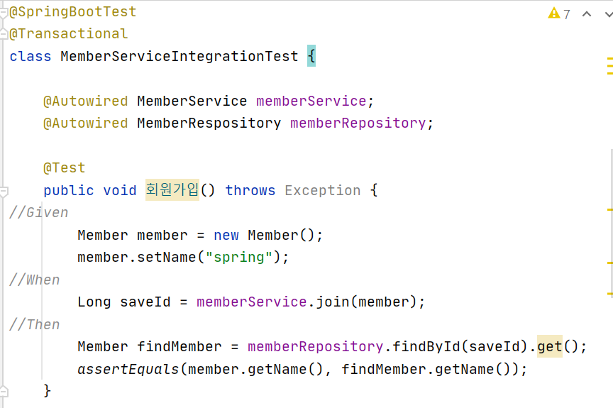
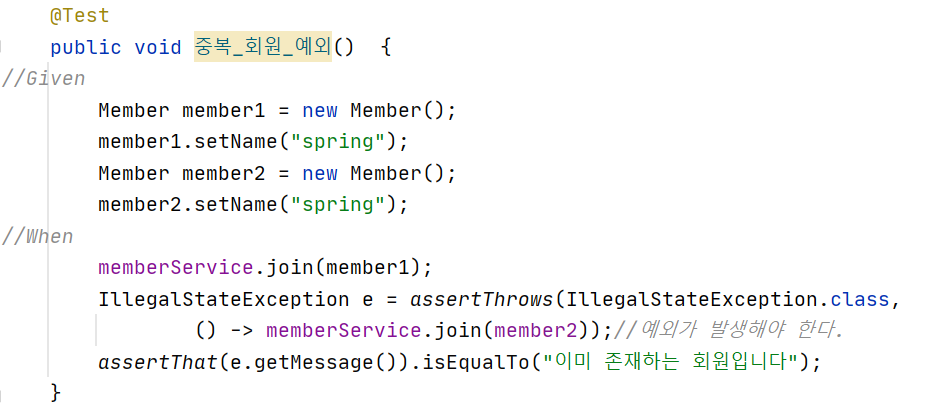

- @SpringBootTest: 스프링 컨테이너와 테스트 함께 실행
- @Transactional: 테스트 케이스에 있으면, 테스트 시작전에 트랜잭션을 시작하고, 테스트 완료후에 항상 롤백. DB에 데이터가 남지 않으므로 다음 테스트에 영향을 주지 않음
    - 서비스에 붙으면 롤백하지 않음

- @beforeEach,@afterEach는 매우 짧은시간에 디버깅됨

- 컨테이너에 올리는 것 보다 단위테스트로 하는 것이 좋음

<br/>

### 스프링 JdbcTemplate

-----------------


스프링 JdbcTemplate과 MyBatis 같은 라이브러리는 JDBC API에서 본 반복 코드를 대부분 제거해줌

하지만 SQL은 직접 작성해야함

**스프링 JdbcTemplate회원 리포지토리**

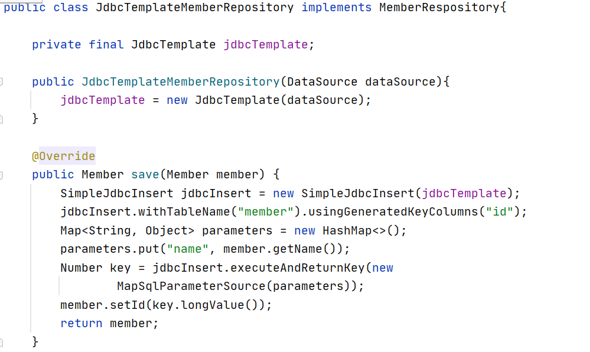
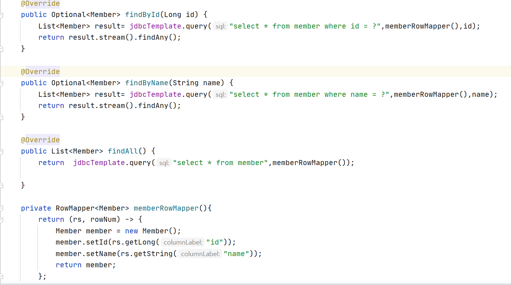

<br/>

**JdbcTemplate을 사용하도록 스프링 설정 변경**

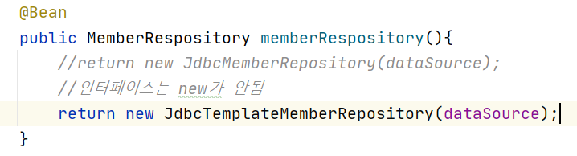

<br/>

- 생성자가 딱 1개면 스프링빈으로 등록시 Autowired생략가능
- 테스트를 잘 작성하는 것이 중요함

<br/>

### JPA

--------------

<br/>

JPA는 기존의 반복 코드는 물론, 기본적인 SQL도 직접 만들어서 실행해줌

JPA사용시, SQL과 데이터 중심의 설계에서 객체 중심의 설계로 패러다임 전환가능

개발 생산성을 크게 높임

JPA는 표준 인터페이스,ORM기술임

<br/>

***설정***

1) build.gradle에 JPA라이브러리 추가

```
implementation 'org.springframework.boot:spring-boot-starter-data-jpa'
```
- spring-boot-starter-data-jpa 는 내부에 jdbc 관련 라이브러리를 포함

2) 스프링 부트에 JPA설정 추가(resources/application.properties)

```
spring.jpa.show-sql=true
spring.jpa.hibernate.ddl-auto=none
```

- show-sql:JPA가 생성하는 SQL 출력
- ddl-auto:JPA는 테이블을 자동으로 생성하는 기능을 제공하는데 
        none을 사용하면 해당기능 끔
    - create: 엔티티 정보를 바탕으로 테이블 직접 생성

<br/>

**JPA 엔티티 매핑**

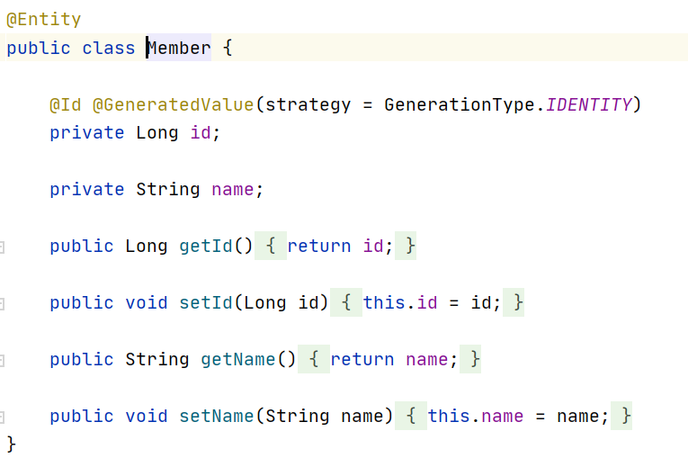

- @Entity:jpa가 관리한다는 것을 명시
- DB가 알아서 id를 넣어주는것을 IDENTITY

<br/>

**JPA 회원 리포지토리**

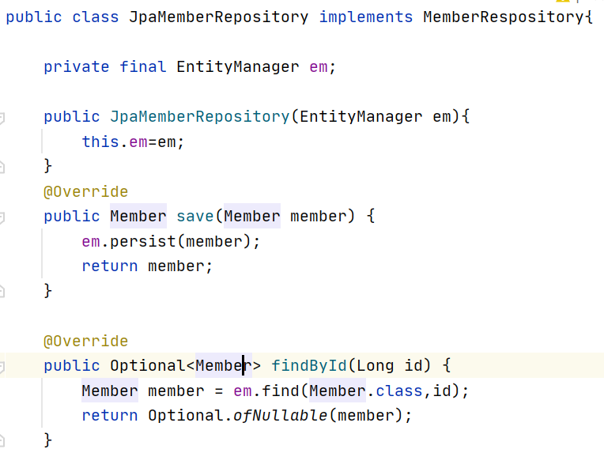
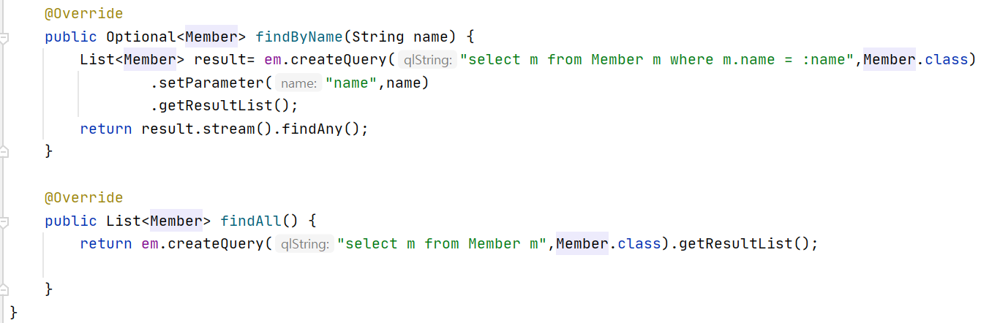

- EntityManager로 동작함(자동으로 생성)
- save에서 insert query를 다 해주고 id까지 해줌
- findall에서 Member엔티티 자체를 select

<br/>

**서비스 계층에 트랜잭션 추가**

```
@Transactional
public class MemberService {
```

- org.springframework.transaction.annotation.Transactional 를 사용
- 스프링은 해당 클래스의 메서드를 실행할 때 트랜잭션을 시작하고, 메서드가 정상 종료되면 트랜잭션을 커밋
    - 런타임 예외 발생시 롤백

- JPA를 통한 모든 데이터 변경은 트랜잭션 안에서 실행

<br/>

**JPA를 사용하도록 스프링 설정 변경**

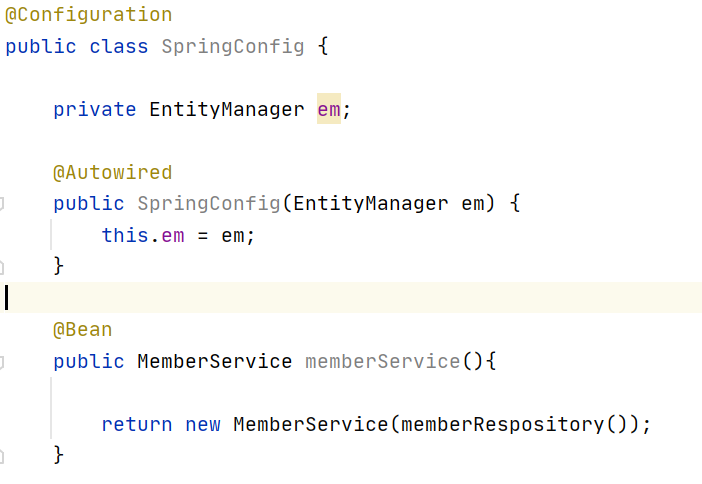
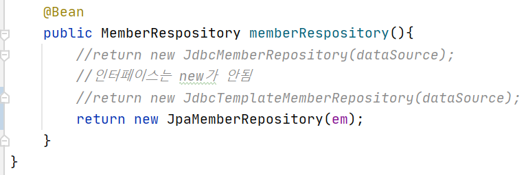

<br/>

### 스프링 데이터 JPA

-------------------------

- 스프링 데이터 JPA를 사용하면, 기존의 한계를 넘어 리포지토리에 구현 클래스 없이 인터페이스만으로 개발 완료할 수 있음

- CRUD기능도 스프링 데이터 JPA가 모두 제공
- 실무에서 관계형 데이터베이스를 사용한다면 스프링데이터 JPA는 필수
- **스프링 데이터 JPA는 JPA를 편리하게 사용하도록 도와주는 기술. JPA학습 후 스프링데이터 JPA학습**

<br/>

**스프링 데이터 JPA회원 리포지토리**

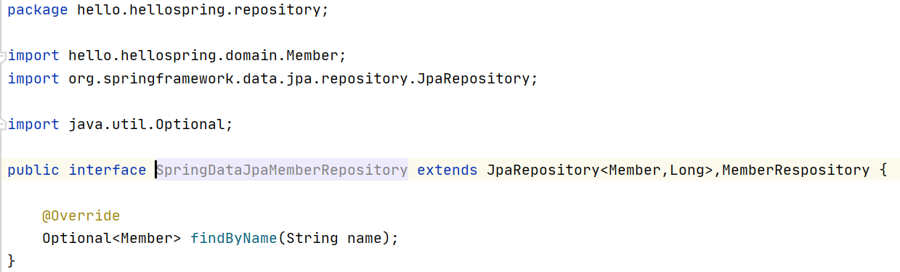

<br/>

**스프링 데이터 JPA 회원 리포지토리를 사용하도록 스프링 설정 변경**

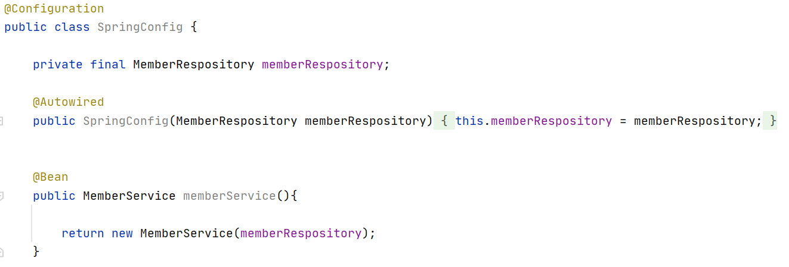
- 스프링 데이터 JPA가 SpringDataJpaMemberRepository 를 스프링 빈으로 자동 등록함

***스프링데이터 JPA 제공 클래스***

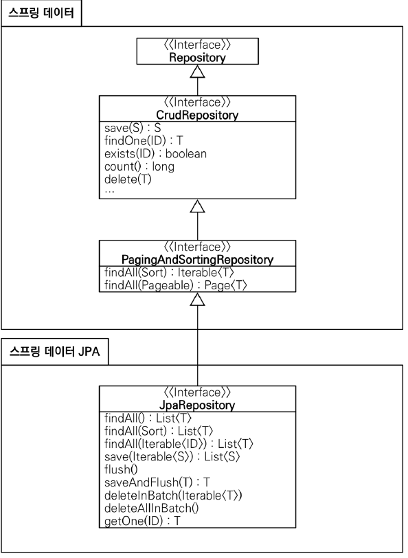
- findAll,findAllById등 기능을 이미 가지고 있음
- 인터페이스를 통한 기본적인 CRUD
    - 메서드이름에And와 OR등을 사용할 수도있음
    - Querydsl이라는 라이브러리는 복잡한 동적쿼리를 자바코드로 안전하고 편리하게 작성할 수 있음