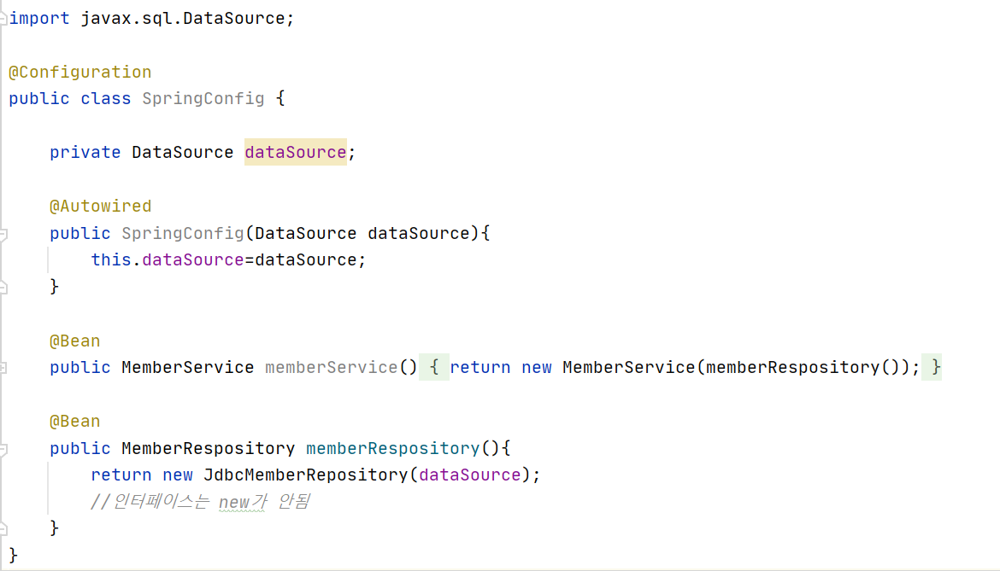

<h1>스프링 DB 접근 기술</h1>

<h3>H2 데이터베이스 설치</h3>

----------------

- https://www.h2.database.com 에서 다운로드 설치
- h2 열고 데이터 베이스 파일 생성
    - jdbc:h2:~/test(최초 한번)
    - ~/test.mv.db 파일 생성 확인
    - 이후부터는 jdbc:h2:tcp://localhost/~/test 이렇게 접속

<b> 테이블 생성하기</b>

h2 콘솔 열고 create table

 

 이후 프로젝트 루트에 sql/ddl.sql파일 생성

 

<h3>순수 JDBC</h3>

----------------------

<b>*설정 추가*</b>

- build.gradle에 라이브러리 추가
<pre>
implementation 'org.springframework.boot:spring-boot-starter-jdbc'
runtimeOnly 'com.h2database:h2'
</pre>

- 스프링 부트 DB연결 설정 추가(resources/application.properties)

<pre>
spring.datasource.url=jdbc:h2:tcp://localhost/~/test
spring.datasource.driver-class-name=org.h2.Driver</pre>

<b>*JDBC 리포지토리 구현</b>

<b>Jdbc 회원 리포지토리</b>

 

<b>스프링 설정 변경</b>

- DataSource는 데이터 베이스 커넥션을 획득할 때 사용되는 객체
- 스프링 부트는 데이터베이스 커넥션 정보를 바탕으로 DataSource를 생성하고 스프링 빈으로 만들어둠
그래서 DI를 받을 수 있음
- 인터페이스였던 MemoryMemberRepository를 JdbcMemberRepository로 바꿔넣음

 

<b>*구현 클래스 추가*</b>

 

<b>*스프링 설정*</b>

- OCP:확장에는 열려있고, 수정,변경에는 닫혀있음
- 스프링의 DI를 사용하면 기존 코드를 전혀 손대지 않고, 설정만으로 구현 클래스를 변경할 수 있음
- 데이터를 DB에 저장하므로 스프링 서버를 다시 실행해도 데이터가 안전하게 저장

 

<h3>스프링 통합 테스트</h3>

---------------

스프링 컨테이너와 DB연결한 통합 테스트

 

<b>회원 서비스 스프링 통합 테스트</b>

- @SpringBootTest: 스프링 컨테이너와 테스트 함께 실행
- @Transactional: 테스트 케이스에 있으면, 테스트 시작전에 트랜잭션을 시작하고, 테스트 완료후에 항상 롤백. DB에 데이터가 남지 않으므로 다음 테스트에 영향을 주지 않음
    - 서비스에 붙으면 롤백하지 않음

- @beforeEach,@afterEach는 매우 짧은시간에 디버깅됨

- 컨테이너에 올리는 것 보다 단위테스트로 하는 것이 좋음

 

<h3>스프링 JdbcTemplate</h3>

-----------------

스프링 JdbcTemplate과 MyBatis 같은 라이브러리는 JDBC API에서 본 반복 코드를 대부분 제거해줌

하지만 SQL은 직접 작성해야함

<b>스프링 JdbcTemplate회원 리포지토리</b>

 

<b>JdbcTemplate을 사용하도록 스프링 설정 변경</b>

 

- 생성자가 딱 1개면 스프링빈으로 등록시 Autowired생략가능
- 테스트를 잘 작성하는 것이 중요함

