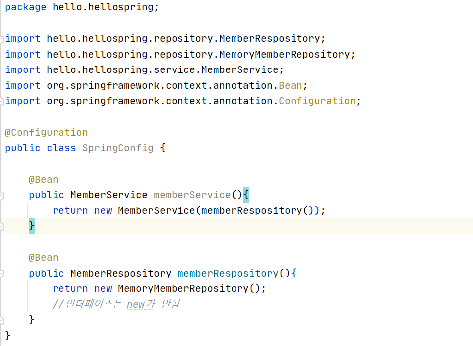

<h1>자바 코드로 직접 스프링 빈 등록하기</h1>

회원 서비스와 회원 리포지토리의 @Service,@Repository,@Autowired 에노테이션을 제거하고 진행

 

<b>*DI*</b>

1. 생성자를 통해서 MemberService가 MemberController에 주입이됨
    - 생성하는 시점에 넣고 변경을 막을 수 있음
    - 가장 좋은 방법

2. 생성자를 빼고 필드에 Autowired(필드 주입)
    - 별로 좋지 않음(오류 발생 가능)
    - 바꿀 수 있는 방법 없음
<pre>@Autowired private final MemberService memberService;</pre>

3. setter에 Autowired를 넣어 set할때 주입하는 것
    - public 하게 노출이 됨
    - 호출되지 말아야할 것을 호출할 수 있음
    - 변경이 많아질 수 있음
<pre>
@Autowired
public void setMemberService(MemberService memberService){
    this.MemberService = memberService;
}
</pre>

<b>여기서는 향후 메모리 리포지토리를 다른 리포지 토리로 변경할 예정이므로, 컴포넌트 스캔 방식 대신에 자바 코드로 스프링 빈을 설정</b>

- XML로 설정하는 방식도 있지만 최근에는 잘 사용하지 않으므로 생략
- 실무에서는 주로 정형화된 컨트롤러,서비스,리포지토리 같은 코드는 컴포넌트 스캔을 사용
- *정형화되지 않거나, 상황에 따라 구현 클래스를 변경해야하면 설정을 통해 스프링 빈으로 등록*
    - Memory memberRepository를 추후에 다른 리포지토리로 바꾸려하는데 기존 멤버서비스나 나머지 코드에 손대지 않고 바꿀수 있음 

- @Autowired를 통한 DI는 스프링이 관리하는 객체에서만 동작, 스프링 빈으로 등록하지 않고 내가 직접 생성한 객체에서는 동작하지 않음

