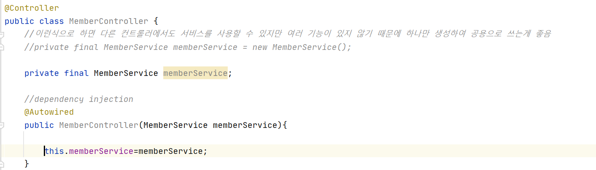
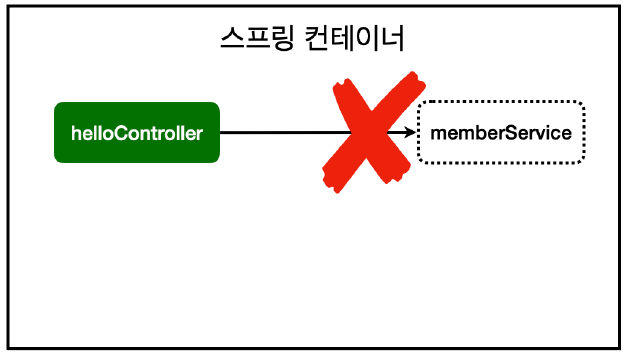
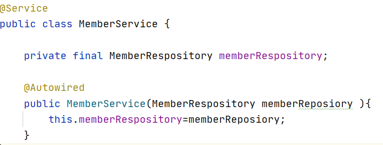
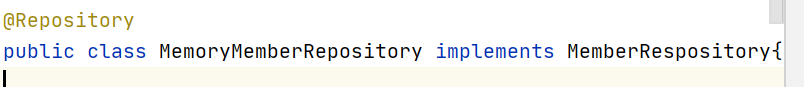
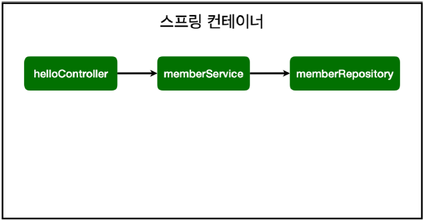

# 컴포넌트 스캔과 자동 의존관계 설정

회원 컨트롤러가 회원서비스와 회원 리포지 토리를 사용할 수 있게 의존관계 설정

***MemberController***

```
private final MemberService memberService = new MemberService();
```

- 이 코드에서 new로 하면 다른 다양한 컨트롤러들이 사용하지만, 기능이 별로 없어 여러 인스턴스를 생성할 필요가 없음
- 스프링컨테이너에 등록하여 하나만 생성하게 함



- 생성자에 @Autowired라고 붙이면 스프링이 연관된 객체를 스프링 컨테이너에서 찾아서 넣어줌
- 객체 의존관계를 외부에서 넣어주는 것을 *DI*, 의존성 주입이라고 한다.


오류 발생
```
Consider defining a bean of type 'hello.hellospring.service.MemberService' in
your configuration
```

- memberService가 스프링 빈으로 등록되어 있지 않음

<br/>



- helloController는 스프링이 제공하는 컨트롤여서 스프링 빈으로 자동등록
- @Controller가있으면 자동 등록됨 

<br/>

***스프링 빈을 등록하는 2가지 방법***

1. 컴포넌트 스캔과 자동 의존관계 설정
2. 자바코드로 직접 스프링 빈 등록하기

***컴포넌트 스캔 원리***

- @Component가 있으면 스프링 빈으로 자동 등록
- @Controller가 스프링 빈으로 자동등록된이유도 컴포넌트 스캔 때문

- @Component를 포함하는 다음 에노테이션도 스프링 빈으로 자동 등록
    - @Controller
    - @Service
    - @Repository

<br/>

**회원 서비스 스프링 빈 등록**



- 생성자에 @Autowired를 사용하면 객체 생성 시점에 스프링 컨테이너에서 해당 스프링 빈을 찾아 주입
- 생성자가 1개만 있으면 @Autowired생략 가능

**회원 리포지토리 스프링 빈 등록**



<br/>

***스프링 빈 등록 이미지***



- 스프링은 스프링 컨테이너에 스프링 빈을 등록할 때, 기본으로 싱글톤으로 등록함(유일하게 하나만 등록해서 공유)
- 같은 스프링 빈이면 모두 같은 인스턴스
- 해당 패키지를 포함하여 동일 또는 하위 패키지가 아니면 스프링 빈으로 컴포넌트 스캔에 대상이 아님