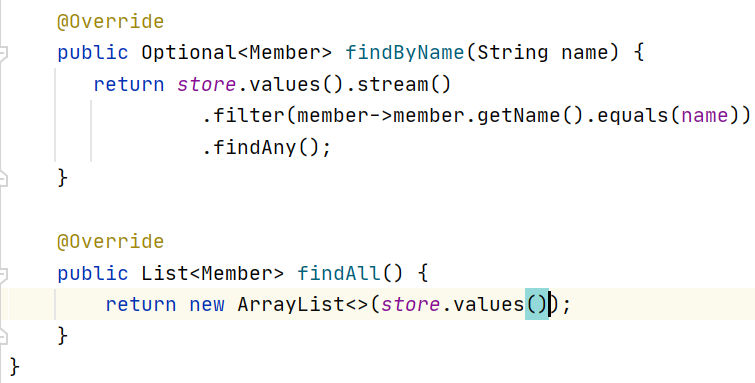

<h1>회원 관리 예제 - 백엔드 개발</h1>

<h3> 비즈니스 요구사항 정리</h3>

---------------

 

- 데이터:회원 ID,이름
- 기능:회원등록, 조회

<b>*일반적인 웹 애플리케이션 계층 구조*</b>

- 컨트롤러:웹 MVC의 컨트롤러 역할
- 서비스: 핵심 비즈니스 로직 구현
- 리포지토리:데이터베이스에 접근, 도메인 객체를 DB에 저장하고 관리
- 도메인:비즈니스 도메인 객체, ex)회원, 주문, 쿠폰 등등 주로 데이터베이스에 저장하고 관리됨

 

<b>*클래스 의존 관계*</b>

- 아직 데이터 저장소가 선정되지 않아서, 우선 인터페이스로 구현 클래스를 변경할 수 있도록 설계
- 개발을 진행하기 위해서 초기 개발 단계에서는 구현체로 가벼운 메모리 기반의 데이터 저장소 사용

 

<h3>회원 도메인과 리포지토리 만들기</h3>

---------------

 

1) Member 객체

 

2)회원 리포지토리 인터페이스

 

3)회원 리포지토리 메모리 구현체

 

<h3>회원 리포지토리 테스트 케이스 작성</h3>

-------------

 개발한 기능을 실행해서 테스트 할 때 자바의 main 메서드를 통해서 실행하거나, 웹 애플리케이션의 컨트롤러를 통해서 해당 기능을 실행한다. 

이러한 방법은 준비하고 실행하는데 오래 걸리고, 반복 실행하기 어렵고 여러 테스트를 한번에 실행하기 어렵다는 단점이 있다 

자바는 JUnit이라는 프레임워크로 테스트를 실행해서 이러한 문제를 해결한다

 

<b>*회원 리포지토리 메모리 구현체 테스트*</b>

- @AfterEach: 한번에 여러 테스트를 실행하면 메모리 DB에 직전 테스트의 결과가 남을 수 있음. 이전테스트 때문에 다음 테스트가 실패할 가능성이 있음. 
- @AfterEach를 사용하면 각 테스트가 종료될때마다 이 기능을 실행함 

- 테스트 순서에 의존관계가 없어야 하므로 테스트가 실행될 때마다 종료되어야함
<pre>
MemoryMemberRepository.java에 추가

public void clearStore(){
        store.clear();
    }
</pre>

 

<h3>회원 서비스 개발</h3>

--------------

 

 

<h3>회원 서비스 테스트</h3>

-------------

 

기존에는 회원 서비스가 메모리 회원 리포지토리를 직접 생성하게 함

<pre>
public class MemberService {
    private final MemberRepository memberRepository =   new MemoryMemberRepository();
}
</pre>

 

회원 리포지토리의 코드가 회원 서비스 코드를 DI 가능하게 변경

<pre>
public class MemberService {
    private final MemberRepository memberRepository;

    public MemberService(MemberRepository memberRepository) {        
        this.memberRepository =memberRepository;    }    
        ... 
        }
    </pre>

 

<b>*회원 서비스 테스트*

