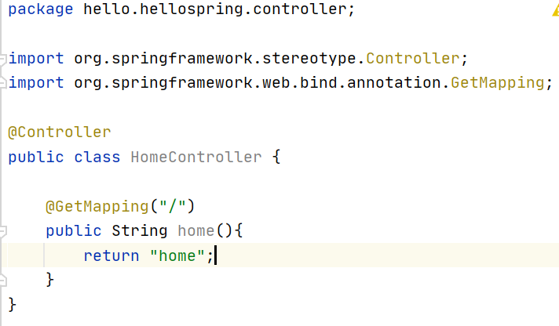
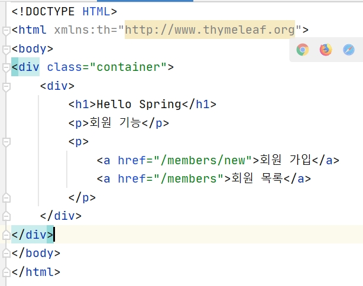
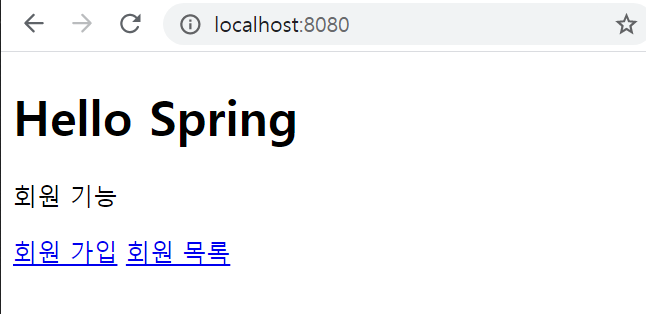
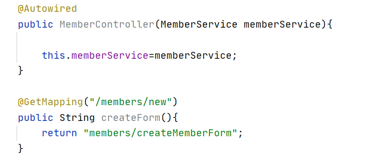
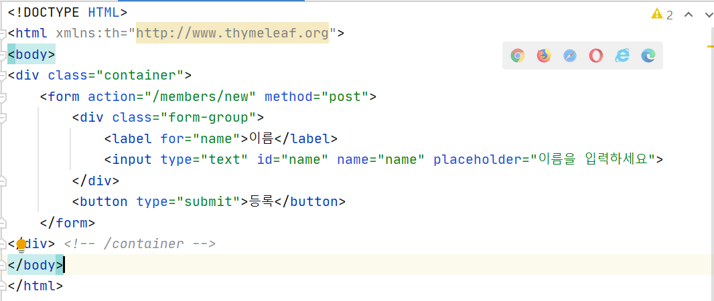
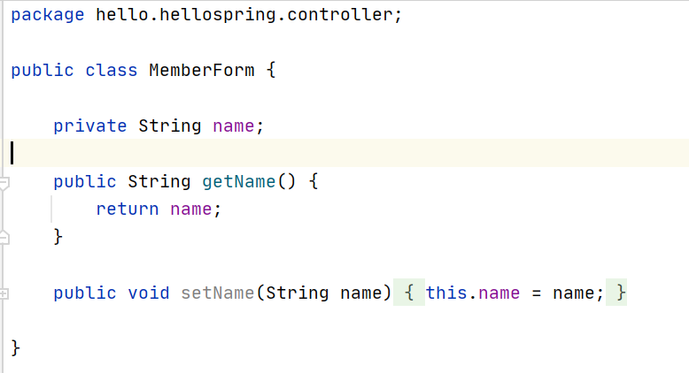
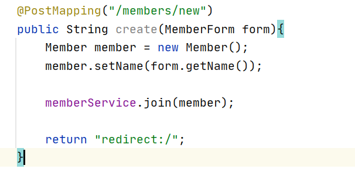
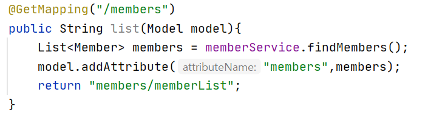
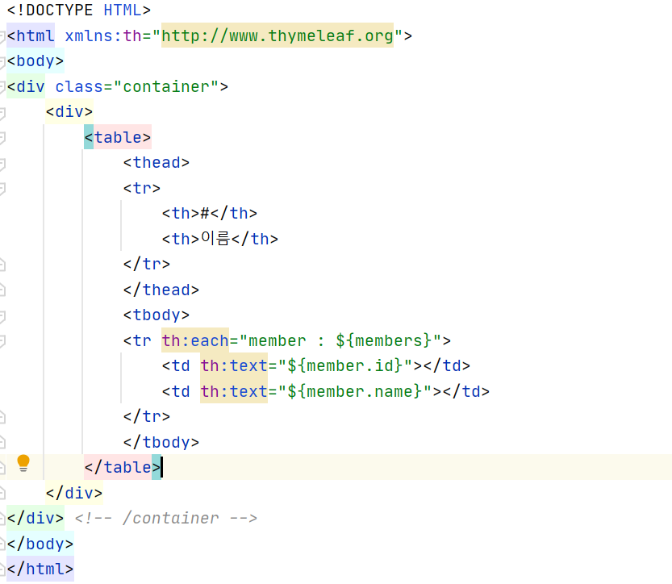
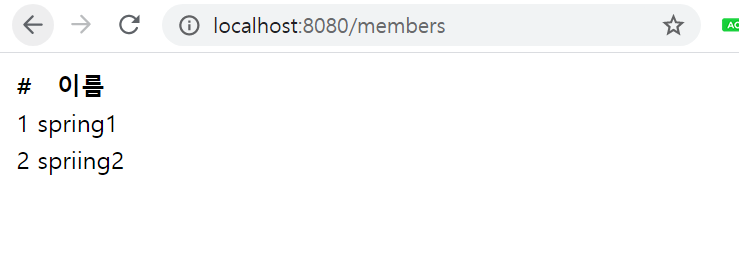

<h1>회원 관리 예제 - 웹 MVC 개발</h1>

<h3> 회원 웹 기능 - 홈 화면 추가</h3>

------------------

1) 홈 컨트롤러 추가

 

2) 회원 관리용 홈

- 먼저 controller에서 매핑된 html을 찾고, 없다면 리소스에 있는 정적 파일 html을 연결함
- controller에 매핑된 html이 존재함
- 컨트롤러가 정적파일보다 우선순위가 높음

 

<h3>회원 웹 기능 - 등록</h3>

----------------------

<b>회원 등록 폼 컨트롤러</b>

 

<b>회원 등록 폼 HTML</b>

 

<b>*회원 등록 컨트롤러*</b>

<b>웹 등록 화면에서 데이터를 전달 받을 때 폼 객체</b>

 

<b>회원 컨트롤러에서 회원을 실제 등록하는 기능</b>

 

- html input에 있는 name을 통해 MemberController에서 setter로 받아  join안의 member에 저장한다
- get형식은 url을통해서 정보가 표시되고 post형식은 표시하지 않고 보낸다
- get형식은 주로 조회시 많이 사용,post는 등록 및 요청시 사용

 

<h3>회원 웹 기능 - 조회</h3>

------------------------

<b>회원 컨트롤러에서 조회 기능</b>

 

<b>회원 리스트 HTML</b>

- 입력한 members를 model로 보내 등록함

